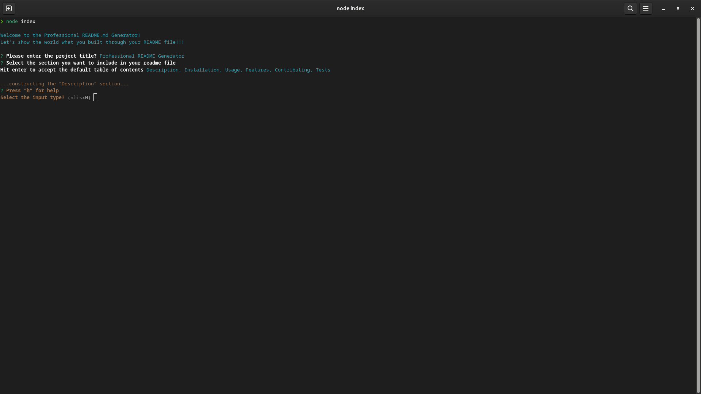
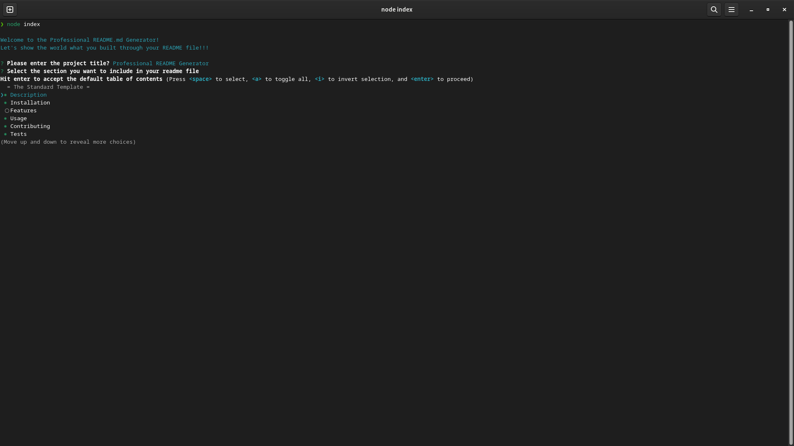

# PROFESSIONAL README GENERATOR

    

## Description

This application is a time-saving tool for the developer to consistently reproduce high-quality README.md file for their application. It also aides the developer to quickly and easily create a README file by using this command-line application to generate one. This allows the project creator to devote more time to working on the project.

### User Story

```
AS A developer
I WANT a README generator
SO THAT I can quickly create a professional README for a new project.

```


## Table of Contents

- [Description](#description)
- [Usage](#usage)
- [Tests](#tests)
- [Questions](#questions)
- [License](#license)
---

## Usage

nvoking the application by entering the following command:

	node index

Once invoked, please follow screen prompts to generate your README.md file. [This link](#somelink) also provides a demonstrates the application's usage.


## Tests






## Questions

If you have any questions, please feel free to reach out to me at: [ikubiti@icloud.com](mailto:ikubiti@icloud.com).

Alternatively, you may find my profile on GitHub at [https://github.com/ikubiti](https://github.com/ikubiti).

---

## License

Copyright (c) ikubiti. All rights reserved.

Licensed under the [MIT](./LICENSE) license.
