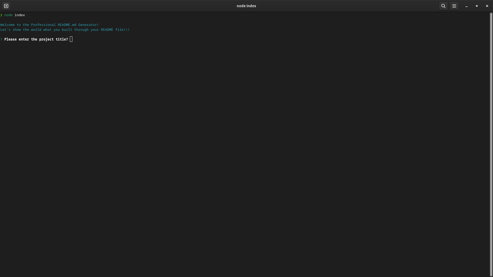
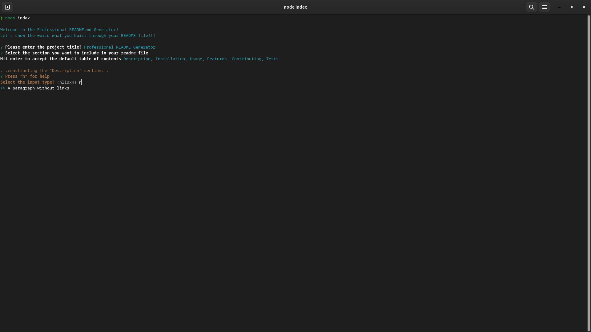
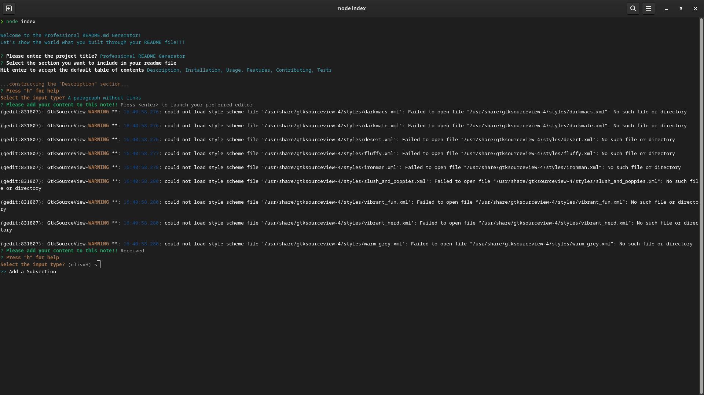
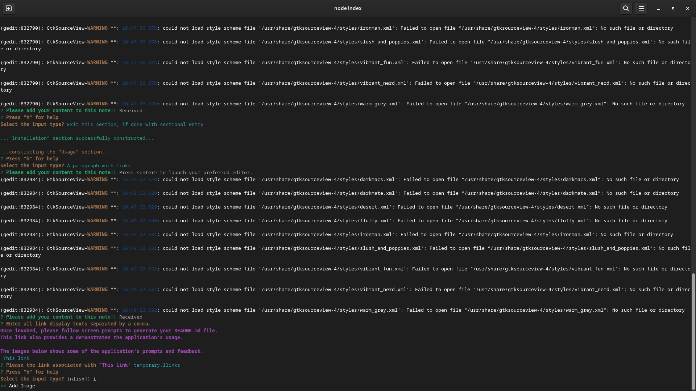
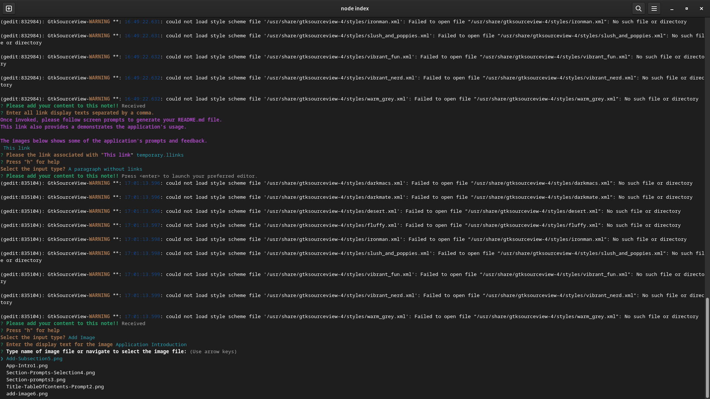
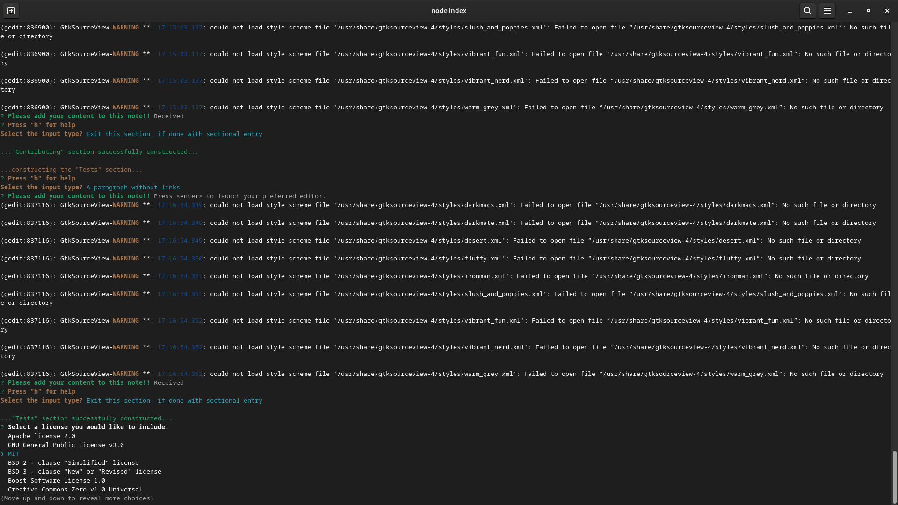
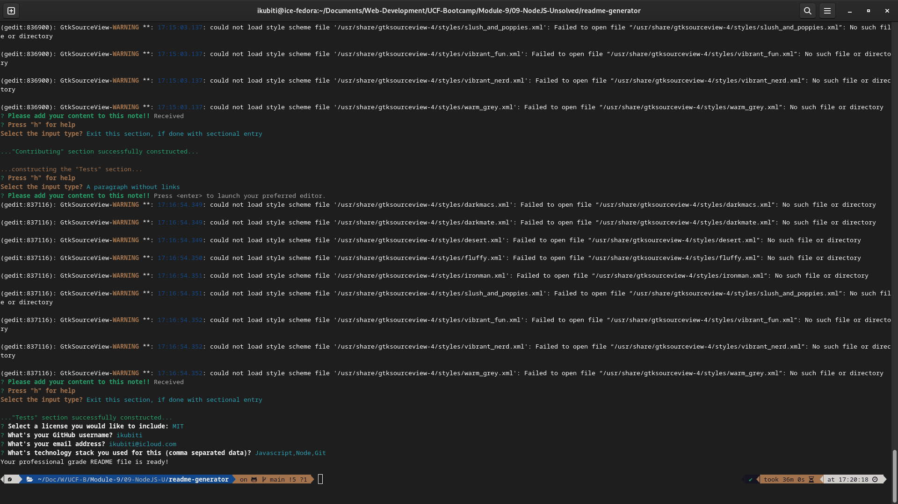

# PROFESSIONAL README GENERATOR

    

## Description

This application is a time-saving tool for the developer to consistently reproduce high-quality README.md file for their application. It also aides the developer to quickly and easily create a README file by using this command-line application to generate one. This allows the project creator to devote more time to working on the project.

THIS README.md FILE WAS CREATED WITH THIS APPLICATION!!

My objectives for this application is based on the following user story and acceptance criteria;

### User Story

```
AS A developer
I WANT a README generator
SO THAT I can quickly create a professional README for a new project.

```

### Acceptance Criteria

```
GIVEN a command-line application that accepts user input
- WHEN I am prompted for information about my application repository
THEN a high-quality, professional README.md is generated with the title of my project and sections entitled Description, Table of Contents, Installation, Usage, License, Contributing, Tests, and Questions
- WHEN I enter my project title
THEN this is displayed as the title of the README
- WHEN I enter a description, installation instructions, usage information, contribution guidelines, and test instructions
THEN this information is added to the sections of the README entitled Description, Installation, Usage, Contributing, and Tests
- WHEN I choose a license for my application from a list of options
THEN a badge for that license is added near the top of the README and a notice is added to the section of the README entitled License that explains which license the application is covered under
- WHEN I enter my GitHub username
THEN this is added to the section of the README entitled Questions, with a link to my GitHub profile
- WHEN I enter my email address
THEN this is added to the section of the README entitled Questions, with instructions on how to reach me with additional questions
- WHEN I click on the links in the Table of Contents
THEN I am taken to the corresponding section of the README

```

## Table of Contents

- [Description](#description)
- [Installation](#installation)
- [Usage](#usage)
- [Features](#features)
- [Contributing](#contributing)
- [Tests](#tests)
- [Questions](#questions)
- [License](#license)

---

## Installation

All you need is a terminal and for now the application folder.

## Usage

Once invoked, please follow screen prompts to generate your README.md file.
[The Professional README Generator](https://drive.google.com/file/d/1j3Ws8BgAs7qIYH_0QAcu5aHD3WVkIcox/view?usp=sharing) demonstration link also provides a demonstrates the application's usage. The README generated in the demo is included here as [README-demo.md](./README-demo.md)

The images below shows some of the application's prompts and feedback.

The application's introduction page.



The prompts for creating the table of contents.


The prompt to create the Description section. These prompts are generic for any section.


The application provides usage hints as the user makes a selection.



The prompts for adding a subsection.



The user selects to add an image.



The prompts for adding an image.



The user being prompted to select a license for the application.



The last prompts of the application asking for Github username and its exit message.



## Features

In addition to fulfilling the above requirements, the application also has the following features:

1.  The user isn't restricted to a single README.md template format, the user can add or create their custom README structure when prompted to construct the table of contents.
2.  The user can create subsections under any section to add additional content as illustrated in the description of this README file.
3.  The user can add links and images to the file as illustrated in this file.
4.  The app applies some formatting to the titles of all the sections irrespective of the user's input.
5.  The app generates a minimal LICENSE file if it doesn't already file.

## Contributing

The user can add instructions for their application here. This section is optional and may be omitted by the user.

## Tests

The user can add instructions for testing their application here. This application has no test presently but they will be added during revision.

## Questions

If you have any questions, please feel free to reach out to me at: [ikubiti@icloud.com](mailto:ikubiti@icloud.com).

Alternatively, you may find my profile on GitHub at [https://github.com/ikubiti](https://github.com/ikubiti).

---

## License

Copyright (c) ikubiti. All rights reserved.

Licensed under the [MIT](./LICENSE) license.

